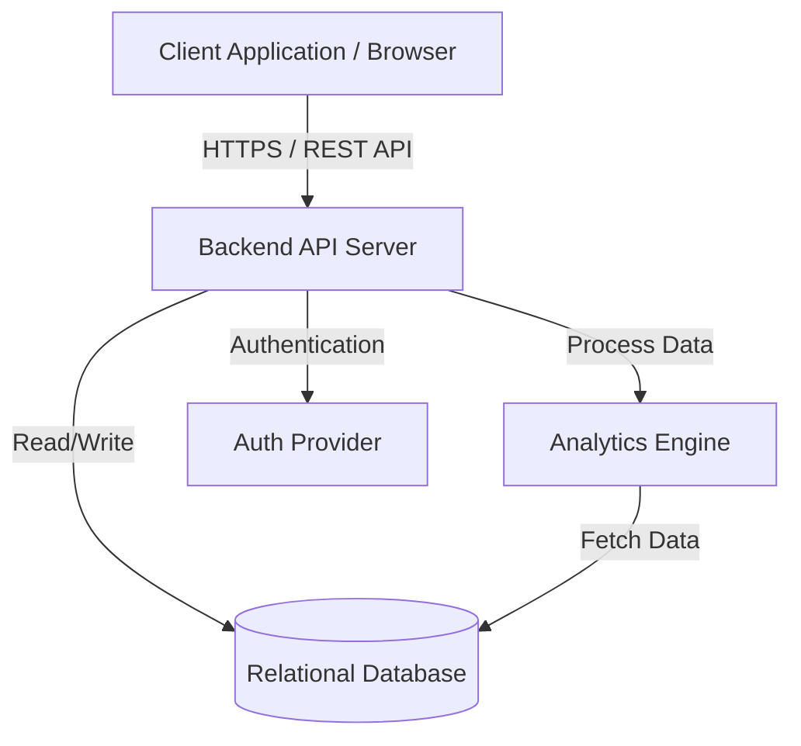

# HR Ops: HR Operations Automation System

## Overview

**HR Ops** is a comprehensive solution designed to automate and streamline day-to-day Human Resources activities. By leveraging modern technology, the system reduces manual overhead, improves data accuracy, and provides actionable insights into the workforce.

The project focuses on centralizing HR data and providing intuitive tools for policy management, employee tracking, and performance analysis.

## Core Features

### Policy Management
- **Centralized Repository:** A single source of truth for all organizational policies and procedures.
- **Smart Querying:** Quickly find specific policy details through an intelligent search interface.
- **Version Control:** Track changes and ensure employees always have access to the latest versions.

### Employee Management
- **Employee Directory:** Detailed profiles including contact information, roles, and department hierarchy.
- **Onboarding/Offboarding:** Automated workflows to ensure smooth transitions for new hires and departing employees.
- **Data Privacy:** Secure handling of sensitive employee information with role-based access control.

### Performance Analytics
- **Performance Tracking:** Set and monitor Key Performance Indicators (KPIs) and goals.
- **Reviews & Feedback:** Streamlined performance review cycles with integrated feedback loops.
- **Trend Analysis:** Identify high-performers and areas for improvement through historical data.

### Interactive Dashboards
- **Visual Insights:** Real-time data visualization of workforce metrics (turnover rate, diversity, headcounts).
- **Manager Views:** Dedicated dashboards for department heads to monitor their team's health.
- **Reporting:** Exportable reports for executive decision-making.

## System Architecture

The following diagram illustrates the high-level architecture and component interactions of the HR Ops platform.



### System Flow

1. **User Interaction**: Users access the system via the modern web frontend.
2. **API Communication**: The frontend communicates with the Python-based backend via RESTful API calls over secure HTTPS.
3. **Authentication & Authorization**: The backend verifies user identity and permissions before processing requests.
4. **Business Logic & Storage**: The backend executes core HR logic and performs necessary CRUD operations on the primary relational database.
5. **Data Processing**: For performance analytics and reporting, the backend leverages the analytics engine to process raw data from the database into aggregated insights.
6. **Response**: The backend formats the processed data and returns it to the frontend for visualization in interactive dashboards.

## Technical Documentation

### Tech Stack
- **Backend:** Python (Django/FastAPI/Flask)
- **Database:** PostgreSQL / SQLite
- **Frontend:** Modern Web Framework (React/Vue/Angular)
- **Analytics:** Pandas / NumPy for data processing
- **Visualization:** D3.js / Chart.js / Plotly

### Getting Started

#### Prerequisites
- Python 3.9+
- Node.js (for frontend components)
- Virtual Environment (venv/conda)

#### Installation

1. **Clone the repository:**
   ```bash
   git clone https://github.com/your-repo/hr-ops.git
   cd hr-ops
   ```

2. **Set up the Backend:**
   ```bash
   python -m venv venv
   source venv/bin/activate  # On Windows: venv\Scripts\activate
   pip install -r requirements.txt
   ```

3. **Set up Environment Variables:**
   Create a `.env` file in the root directory and add necessary configurations (Database URL, API Keys, etc.).

4. **Run Migrations:**
   ```bash
   python manage.py migrate  # If using Django
   ```

5. **Start the Development Server:**
   ```bash
   python manage.py runserver
   ```

### Project Structure
```text
hr-ops/
├── backend/            # Core logic and API
├── frontend/           # UI components and dashboards
├── docs/               # Detailed documentation
├── tests/              # Automated test suites
├── requirements.txt    # Python dependencies
└── README.md           # Project overview
```

## Contributing
We welcome contributions to HR Ops! Please refer to our [CONTRIBUTING.md](CONTRIBUTING.md) for guidelines on how to submit pull requests and report issues.

## License
This project is licensed under the MIT License - see the [LICENSE](LICENSE) file for details.
